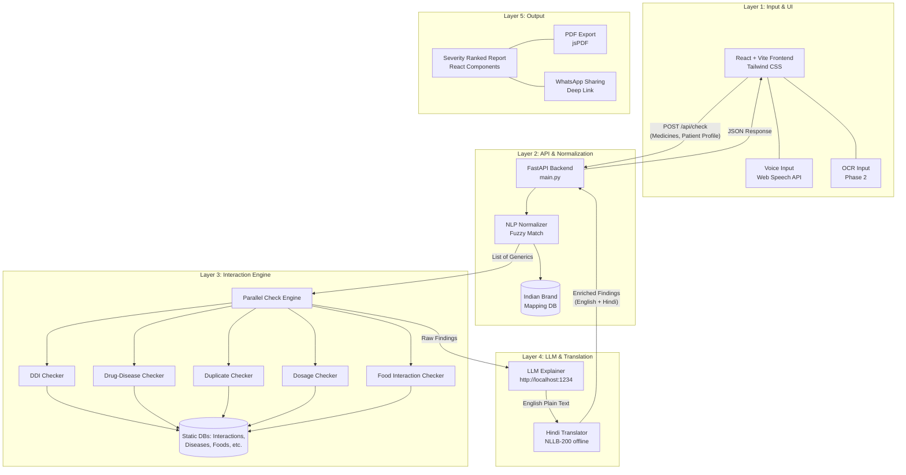

# MedSafe India: Architecture & Implementation Plan

## System Architecture

The system is built on a 5-layer architecture designed to handle Indian polypharmacy intricacies, including brand-to-generic normalization and local LLM translations for offline capabilities.

---

## Implementation Plan

### Layer 1: Input (React/Vite Frontend)
- **Framework**: React + Vite for fast bundling.
- **Styling**: Tailwind CSS v4 with a custom dark medical aesthetic (glassmorphism effect).
- **Core Components**:
  - `MedicineInput.jsx`: Fuzzy search autocomplete, tag management, and Web Speech API integration.
  - `PatientProfile.jsx`: Capture age, weight, and chronic conditions (Diabetes, CKD, etc.).
  - `InteractionReport.jsx`: Render the severity-ranked findings.

### Layer 2: NLP Normalization (Node.js/FastAPI Backend)
- **Framework**: Python FastAPI.
- **Normalizer**: Uses `rapidfuzz` to map 100+ common Indian branded drugs (e.g., Glycomet, Ecosprin) to their generic names and standard doses.

### Layer 3: Interaction Engine (Python/FastAPI)
Five parallel checkers running against static JSON databases seeded with priority Indian-context interactions:
1. **DDI Detection**: Checks for pairs causing severe reactions (e.g., Warfarin + Aspirin).
2. **Drug-Disease Conflict**: Flags contraindications based on patient profile (e.g., NSAIDs + CKD).
3. **Duplicate Therapy**: Clusters medicines by taxonomical classes to detect redundancy.
4. **Dosage Anomaly**: Adjusts max thresholds for elderly patients (age > 65).
5. **Food Interaction**: Flags diet conflicts (e.g., Warfarin + Leafy greens).

### Layer 4: LLM Explanation Layer (Local/Offline)
- **English Explanations**: Interacts with LM Studio (`http://localhost:1234/v1/chat/completions`) to convert clinical jargon into plain language. Built-in template fallback if the model is offline.
- **Hindi Translation**: Uses HuggingFace `facebook/nllb-200-distilled-600M` running locally in memory to translate the English outputs into Hindi (`hin_Deva`).

### Layer 5: Output & Sharing
- **UI Parsing**: Categorizes findings into severity color bands (Critical=Red, Moderate=Yellow, Safe=Green, Duplicate=Purple, Food=Pink).
- **PDF Export**: Generates a clinical summary using `jspdf` on the client side.
- **WhatsApp**: Uses deep linking to format a shareable summary message for family caregivers.

### Hackathon Build Order
1. Scaffold frontend (Vite/React) and backend (FastAPI).
2. Create static JSON databases (interactions, diseases, foods, dosage).
3. Build the core normalizer & 5-tier interaction engine.
4. Implement the LLM Explainer (LM Studio) and NLLB-200 Hindi translator.
5. Code the React UI (Autocomplete, Profile, Report).
6. Enable Web Speech API for voice and setup PDF/WhatsApp export.
